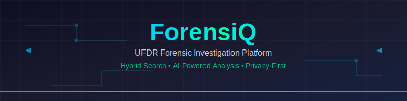

<p align="center">
  
</p>

<p align="center">
  
  
  
  
  
  
</p>

---

# 🔍 ForensiQ — UFDR Forensic Investigation Platform

**ForensiQ** is an advanced, offline-capable forensic investigation system for **Cellebrite UFDR (Universal Forensic Data Report)** files.  
It empowers investigators with **hybrid search, entity extraction, and AI-powered analysis** while ensuring **data privacy and legal compliance**.

---

## ✨ Features

### 🗂️ Phase 1 — Ingest & Parsing

- Parse Cellebrite UFDR ZIP archives
- Extract **messages** (SMS, chats, emails) with metadata
- Parse **contacts & call history**
- Catalog **attachments & media**
- Export structured **JSONL** for downstream processing

### 💾 Phase 2 — Storage & Indexing

- Store data in **PostgreSQL** (or SQLite for demo) with SQLAlchemy ORM
- Index messages in **OpenSearch** for full-text search
- Robust ETL with **idempotent upserts**
- Integrity checks & error handling

### 🧠 Phase 3 — NLP & Entity Extraction

- Detect **phone numbers, emails, URLs, crypto addresses**
- Normalize phones into **E.164 international format**
- Generate **semantic embeddings** using sentence-transformers
- Build **FAISS index** for similarity search

### 🔎 Phase 4 — Hybrid Retrieval & Summarization

- Combine **keyword search (OpenSearch)** + **semantic search (FAISS)**
- Provide **FastAPI REST API** for querying evidence
- Local **summarization** with HuggingFace (BART/T5)  
- Score fusion & relevance ranking

### 🖥️ Phase 5 — Web Interface

- **React + TypeScript** investigator dashboard
- **Interactive search** with entity highlighting
- **Network graph visualization** of relationships
- **Export capabilities** (PDF, HTML, JSON)
- **Responsive design** for all devices

---

## 🚀 Quick Start

### Prerequisites

- **Python 3.11+**
- **Node.js 18+** (for frontend)
- **Docker** (optional, for databases)
- **Git**

### Installation

```bash
# Clone repository
git clone https://github.com/Av7danger/ForensiQ.git
cd ForensiQ

# Set up Python environment
python -m venv venv
source venv/bin/activate  # Windows: venv\Scripts\activate

# Install dependencies
pip install -r requirements.txt
```

### Setup Database

```bash
# Option 1: Docker (Recommended)
docker-compose up -d

# Option 2: Local PostgreSQL
createdb forensiq_db
psql forensiq_db < schema.sql
```

### Run Backend

```bash
cd backend
uvicorn main:app --reload --port 8000
```

### Run Frontend

```bash
cd frontend
npm install
npm start
```

### Process UFDR File

```bash
# Upload and process UFDR
curl -X POST "http://localhost:8000/upload" \
  -F "file=@sample_data.ufdr" \
  -F "case_id=CASE-2024-001"
```

---

## 📖 Usage Guide

### 1. **Upload UFDR Archive**
```bash
POST /upload
Content-Type: multipart/form-data

{
  "file": "evidence.ufdr",
  "case_id": "CASE-2024-001",
  "investigator": "Detective Smith"
}
```

### 2. **Search Messages**
```bash
GET /search?q=suspicious+activity&case_id=CASE-2024-001&limit=50
```

### 3. **Entity Extraction**
```bash
GET /entities?case_id=CASE-2024-001&entity_type=phone_number
```

### 4. **Semantic Search**
```bash
POST /semantic_search
{
  "query": "drug transaction keywords",
  "case_id": "CASE-2024-001",
  "top_k": 20
}
```

### 5. **Export Report**
```bash
GET /export?case_id=CASE-2024-001&format=pdf
```

---

## 🔧 API Reference

### Core Endpoints

#### Upload UFDR File
```http
POST /upload
```
**Request:**
```json
{
  "file": "<binary>",
  "case_id": "string",
  "investigator": "string"
}
```

**Response:**
```json
{
  "status": "success",
  "case_id": "CASE-2024-001",
  "messages_processed": 15420,
  "contacts_extracted": 342,
  "processing_time": "45.2s"
}
```

#### Search Evidence
```http
GET /search?q={query}&case_id={case_id}&limit={limit}
```

**Response:**
```json
{
  "results": [
    {
      "id": "msg_12345",
      "content": "Message text with highlighted terms",
      "timestamp": "2024-01-15T14:30:00Z",
      "sender": "+1234567890",
      "receiver": "+0987654321",
      "relevance_score": 0.95,
      "entities": {
        "phone_numbers": ["+1234567890"],
        "emails": ["suspect@example.com"]
      }
    }
  ],
  "total": 127,
  "query_time": "0.45s"
}
```

#### Entity Extraction
```http
GET /entities?case_id={case_id}&entity_type={type}
```

**Response:**
```json
{
  "entities": [
    {
      "type": "phone_number",
      "value": "+1234567890",
      "normalized": "+1234567890",
      "frequency": 45,
      "first_seen": "2024-01-10T09:15:00Z",
      "last_seen": "2024-01-20T16:45:00Z"
    }
  ]
}
```

---

## 🏗️ Architecture

```
┌─────────────────┐    ┌─────────────────┐    ┌─────────────────┐
│   React Frontend │    │  FastAPI Backend │    │   PostgreSQL    │
│   (TypeScript)   │◄──►│    (Python)     │◄──►│   Database      │
└─────────────────┘    └─────────────────┘    └─────────────────┘
                                │
                       ┌────────┴────────┐
                       │                 │
                ┌─────────────┐   ┌─────────────┐
                │ OpenSearch  │   │    FAISS    │
                │ (Full-text) │   │ (Semantic)  │
                └─────────────┘   └─────────────┘
```

### Key Components

- **UFDR Parser**: Extracts data from Cellebrite archives
- **Hybrid Search**: Combines keyword + semantic search
- **Entity Extractor**: Detects phones, emails, URLs, crypto
- **AI Summarizer**: Generates case summaries
- **Export Engine**: PDF/HTML report generation

---

## 🛠️ Development

### Project Structure
```
ForensiQ/
├── backend/
│   ├── main.py              # FastAPI application
│   ├── models/              # SQLAlchemy models
│   ├── services/            # Business logic
│   ├── parsers/             # UFDR parsing
│   └── utils/               # Utilities
├── frontend/
│   ├── src/
│   │   ├── components/      # React components
│   │   ├── pages/           # Page components
│   │   └── services/        # API clients
│   └── public/
├── tests/
├── docs/
└── docker-compose.yml
```

### Running Tests
```bash
# Backend tests
cd backend
pytest tests/ -v

# Frontend tests
cd frontend
npm test
```

### Building for Production
```bash
# Build frontend
cd frontend
npm run build

# Build Docker image
docker build -t forensiq:latest .
```

---

## 📋 Legal & Compliance

### Evidence Handling
- **Chain of Custody**: All operations logged with timestamps
- **Data Integrity**: SHA-256 checksums for all evidence
- **Audit Trail**: Complete processing history
- **Privacy**: No data leaves local environment

### Supported Formats
- ✅ Cellebrite UFDR (primary)
- ✅ Raw message exports (CSV, JSON)
- ✅ Contact lists (vCard, CSV)
- ⏳ Additional formats (roadmap)

---

## 🤝 Contributing

1. **Fork** the repository
2. **Create** feature branch (`git checkout -b feature/AmazingFeature`)
3. **Commit** changes (`git commit -m 'Add AmazingFeature'`)
4. **Push** to branch (`git push origin feature/AmazingFeature`)
5. **Open** Pull Request

---

## 📜 License

Distributed under the **MIT License**. See `LICENSE` for more information.

---

## 🙏 Acknowledgments

- **Cellebrite** for UFDR format specifications
- **OpenSearch** for full-text search capabilities
- **HuggingFace** for AI/NLP models
- **React** + **TypeScript** for frontend framework

---

<p align="center">
  <b>🔍 ForensiQ — Empowering Digital Forensics with AI</b><br>
  <i>Built with ❤️ for law enforcement and cybersecurity professionals</i>
</p>
